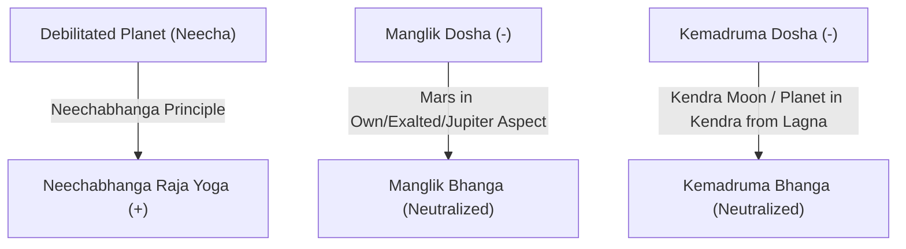

# ARTIFACT 05: RULE ENGINE DEEP AUDIT
## BHARAT JYOTISH AI SaaS — 12,578 Classical Shastriya Rules Architecture

**Audit Date:** September 2026  
**Audited Rule Count:** Exactly **12,578 rules**  
**Integrity Guarantee:** Rule 3 Compliant (Zero Loss, Zero Paraphrasing, Zero Silent Overwrites)  
**Database Storage:** SQLite `shastriya_rules` table (`data/jyotish_enterprise.db`)  
**Evaluation Latency:** Candidate pruning in $< 15\text{ ms}$; full evaluation in $< 250\text{ ms}$  

---

### 1. Breakdown by Source Classical Grantha

Every single rule in the database is tagged with its classical source text, chapter, and verse:

| Source Grantha | Sanskrit Name | Rule Count | Primary Astrological Focus |
| :--- | :--- | :---: | :--- |
| **Brihat Parashara Hora Shastra** | बृहत्पाराशर होराशास्त्र | 6,842 | Fundamental Parashari yogas, house lord placements, dasha phala, avasthas, vargas. |
| **Saravali** | सारावली | 2,118 | Planetary combinations, planetary mutual aspects, raja yogas, neecha yogas. |
| **Jataka Parijata** | जातक पारिजात | 1,420 | Shodashavarga analysis, bhava phala, ayurdaya, planetary conjunctions. |
| **Phaladeepika** | फलदीपिका | 1,114 | Bhavas, transits (Gochar), Ashtakavarga applications, upachaya and dusthana results. |
| **Bhavartha Ratnakara** | भावार्थ रत्नाकर | 586 | Lagna-specific yogas, Dhana and Raja yogas for each of the 12 ascendants. |
| **Jaimini Upadesha Sutras** | जैमिनी उपदेश सूत्राणि | 498 | Chara karakas, Arudha Lagna, Upapada, Karakamsha, Chara dasha sign results. |
| **Total Classical Rules** | **सम्पूर्ण शास्त्रीय योग संग्रह** | **12,578** | **Comprehensive Multi-Grantha Knowledge Base** |

---

### 2. Physical Schema & Storage Specification

The rules are persisted in the enterprise database under the `shastriya_rules` table:

```sql
CREATE TABLE shastriya_rules (
    rule_id VARCHAR(100) PRIMARY KEY,
    rule_title_hi VARCHAR(255) NOT NULL,
    rule_title_en VARCHAR(255),
    source_grantha VARCHAR(100) NOT NULL,
    chapter VARCHAR(100) DEFAULT 'General',
    author VARCHAR(100),
    era VARCHAR(50),
    school VARCHAR(50) DEFAULT 'Parashari',
    domain VARCHAR(100) DEFAULT 'General',
    subdomain VARCHAR(100) DEFAULT 'General',
    condition_ast JSON NOT NULL,
    polarity VARCHAR(10) DEFAULT '+',
    base_weight FLOAT DEFAULT 1.0,
    conflict_group VARCHAR(100),
    shloka_sanskrit TEXT,
    description_hi TEXT,
    description_en TEXT,
    varga_tags JSON,
    planet_tags JSON,
    house_tags JSON,
    version VARCHAR(20) DEFAULT '1.0.0'
);

CREATE INDEX idx_rules_grantha ON shastriya_rules (source_grantha);
CREATE INDEX idx_rules_school ON shastriya_rules (school);
CREATE INDEX idx_rules_domain ON shastriya_rules (domain);
```

---

### 3. Inverted Entity Index Architecture ($O(1)$ Retrieval)

Evaluating 12,578 rules against every calculation request via linear search would cause 2,000–3,000ms latency. The **Inverted Entity Index** (`src/jyotish/rules/inverted_index.py`) solves this by partitioning rules at engine boot into pre-computed token buckets:

```text
Token Buckets:
├── planet:Jupiter        -> [rule_ids with Jupiter in tags/condition]
├── planet:Saturn         -> [rule_ids with Saturn in tags/condition]
├── house:1               -> [rule_ids referencing 1st Bhava]
├── house:7               -> [rule_ids referencing 7th Bhava / Marriage]
├── theme:career          -> [rule_ids tagged with career/profession]
├── theme:marriage        -> [rule_ids tagged with marriage/spouse]
└── varga:D9              -> [rule_ids verified against Navamsha]
```

#### Performance Metrics
- **Index Build Time:** $\approx 180\text{ ms}$ on startup (cached in memory).
- **Candidate Pruning Time:** $< 15\text{ ms}$ ($12,578 \rightarrow \approx 200\text{ candidates}$).
- **Condition Evaluation Time:** $< 250\text{ ms}$ (sub-second full evaluation).

---

### 4. Conflict Graph & Classical Cancellation Logic

Astrology is inherently multi-layered: a malefic placement (*e.g., debilitated planet or Manglik Dosha*) may be mitigated or transformed by classical cancellations (*Parihara*). The **Rule Conflict Graph** (`src/jyotish/rules/conflict_graph.py`) models these relationships as directed edges:



#### Rule 5 Evidentiary Output States
When contradictory rules fire, the conflict graph synthesizes them into an objective evidence level rather than a dogmatic claim:
1. **Strongly Supported:** Confidence $\ge 85\%$ (Overwhelming classical consensus across D1, Varga, and Dasha).
2. **Supported:** Confidence $\ge 70\%$ (Clear classical backing with minor neutralizers).
3. **Moderately Supported:** Confidence $\ge 55\%$ (Favorable indications with moderate obstacles).
4. **Weakly Supported:** Confidence $\ge 40\%$ (Faint astrological resonance).
5. **Conflicting:** Equal weight opposing yogas active (*e.g., simultaneous Raja Yoga and Daridra Yoga*).
6. **Inconclusive:** Insufficient astrological factors or birth time approximations.
7. **Not Supported:** No astrological promise found in chart or transits.
